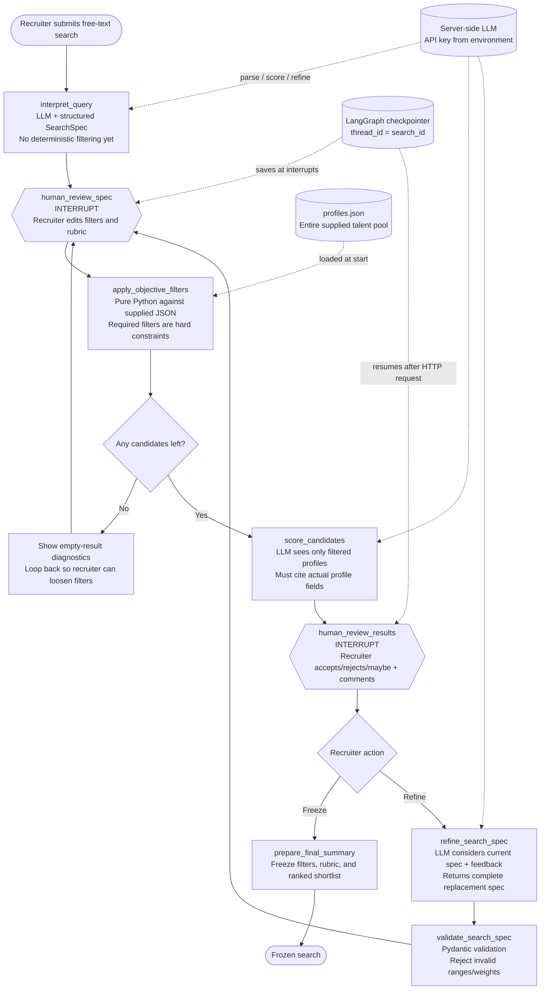

# LangGraph Architecture

This diagram describes one LangGraph workflow for one recruiter search session. The graph pauses at human-review nodes and resumes with the same `thread_id`, so filters, rubric edits, candidate feedback, and refinement rounds remain part of one stateful flow.

## Reading the Flow

- The LLM interprets the recruiter’s language, but application code applies objective filters. This keeps facts such as location, experience, and skills deterministic.
- The first interrupt is an approval boundary. The recruiter owns the final filters and rubric before candidates are scored.
- Ranking is subjective and LLM-assisted, but every explanation must cite evidence from the candidate JSON.
- Feedback creates a loop. The LLM proposes changes, and the recruiter gets another approval opportunity before the next run.
- Empty results are a normal branch, not an exception. The recruiter can adjust the specification and try again.
- Freezing ends the graph and produces the final state required by the assignment.
