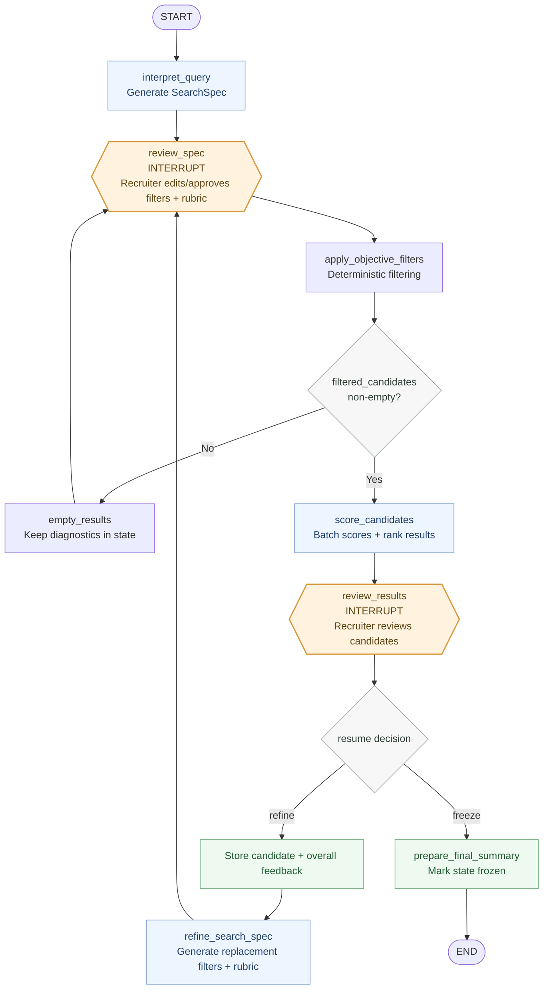

# Pure LangGraph Workflow

This is the workflow-only view of the recruitment search. It excludes FastAPI, React, Groq, and the candidate repository so the graph control flow is easy to study.



## State Movement

```text
original_query
    → filters + rubric
    → recruiter-approved filters + rubric
    → filtered_candidates + diagnostics
    → ranked_results
    → recruiter_feedback
    → replacement filters + rubric
    → frozen final state
```

## Important LangGraph Behavior

- `review_spec` pauses before filtering so the recruiter owns the search specification.
- `review_results` pauses before deciding whether to refine or freeze.
- Resuming `review_spec` routes back through filtering and scoring.
- Resuming `review_results` with `refine` loops through feedback and returns to `review_spec`.
- Resuming `review_results` with `freeze` routes to `prepare_final_summary` and then ends.
- An empty result set is a normal route back to `review_spec`, not a terminal failure.
- Each search uses one LangGraph `thread_id`, allowing interrupt state to resume across HTTP requests.
